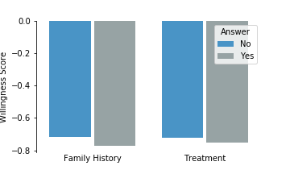
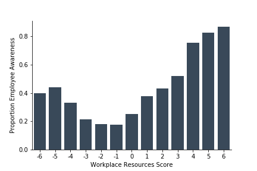
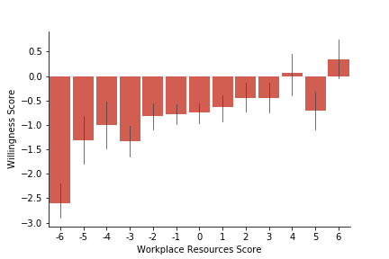

# Mental Health Survey - Exploratory Data Analysis

This repository contains a mini project of exploratory data analysis (EDA) based on a survey about mental health in the tech industry. The dataset can be found [here](https://www.kaggle.com/osmi/mental-health-in-tech-survey).

## Visualizations and Insights

### 1. Willingness to Seek Treatment vs. Family History

This chart compares the willingness score of participants to seek treatment based on their family history of mental health issues and whether they have previously sought treatment. It provides insights into how personal experiences influence treatment-seeking behavior.

---

### 2. Workplace Resources and Employee Awareness

This visualization shows the relationship between workplace resource scores and the proportion of employees aware of mental health resources at their workplace. Higher workplace resource scores indicate greater awareness.

---

### 3. Workplace Resources and Willingness Score

This bar chart examines how the availability of workplace resources affects the willingness score of employees to discuss or seek help for mental health issues. The error bars represent the variability within each group.

---

## Repository Contents
- **Data:** The raw survey data is used for analysis.
- **Scripts:** Python scripts for cleaning, analyzing, and visualizing the data.
- **Visualizations:** The charts above were generated as part of the analysis.

## How to Run
1. Clone this repository.
2. Install the required Python libraries using `pip install -r requirements.txt`.
3. Run the analysis scripts to reproduce the visualizations.

---

### Acknowledgements
Thanks to the Open Sourcing Mental Illness (OSMI) team for collecting and providing the data for public analysis.
